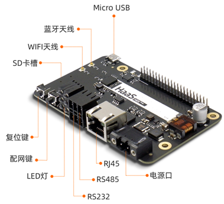
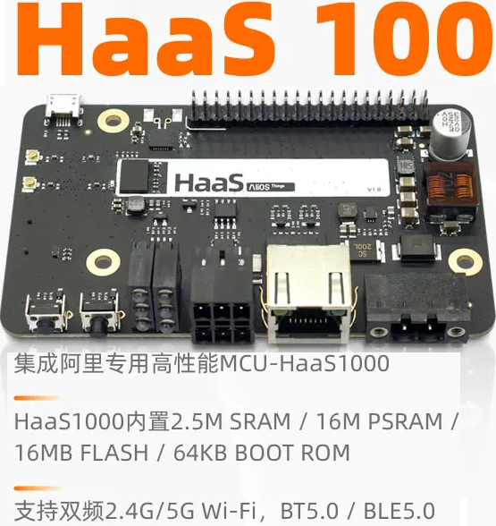
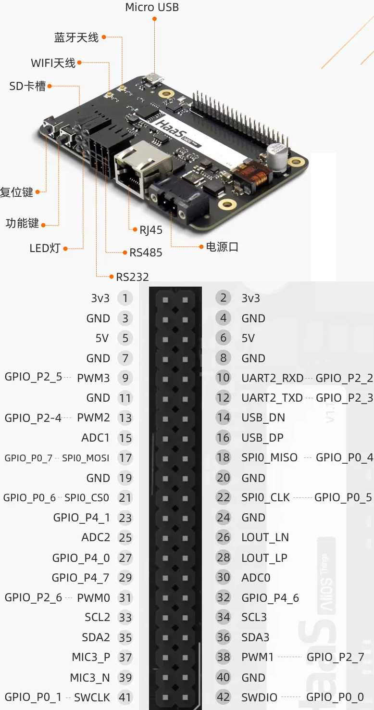
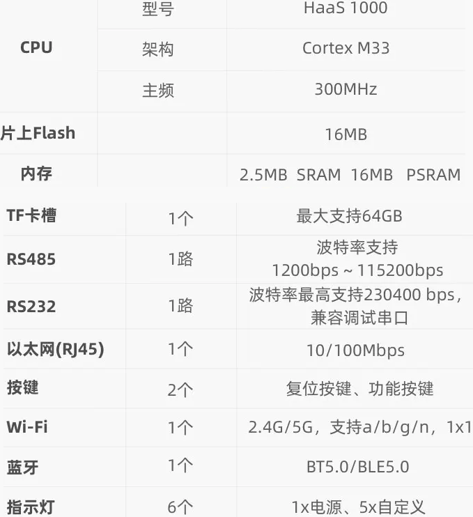
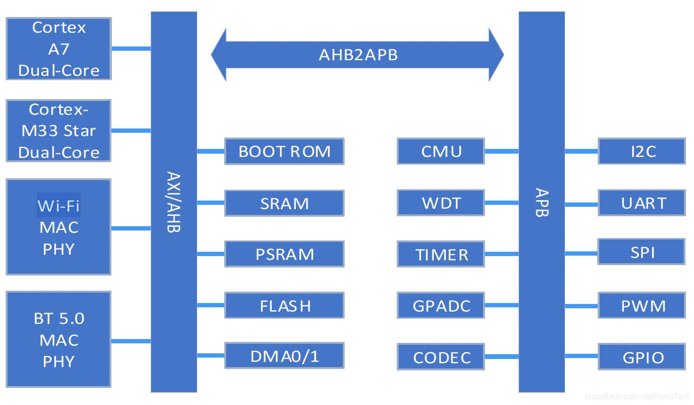

# HaaS 100 Development Board

The Aliyun **HaaS 100** is a high-performance IoT development board based
on the **HaaS1000** SoC. This workspace (`haas100\`) is the AliOS Things
board project for it.

## Board images

Photos of the board live in `board_images\`:

| Image | File |
|-------|------|
| Board view | `board_images/board_0.png` |
| Board view | `board_images/board_1.png` |
| Board view | `board_images/board_2.png` |
| Board view | `board_images/board_3.png` |
| Board view | `board_images/board_4.png` |

```





```

## SoC: HaaS1000

- Dual-core **ARM Cortex-M33** (measured 320 MHz on this board; 300 MHz
  is the nominal spec) + dual-core Cortex-A7 (separate subsystem, disabled
  in this build via `CONFIG_A7_DSP_ENABLE=0`)
- 2.5 MB SRAM, 16 MB PSRAM, **16 MB** QSPI NOR flash
- 2.4G/5G Wi-Fi, dual-mode Bluetooth 5.0, audio codec
- 3x UART (console = UART0), 2x SPI, 2x I2C, 4x PWM, GPADC (10-bit)

## On-board LEDs

From `hardware/board/haas100/drivers/led.c` (pin index == GPIO number,
no offset). LEDs are **active-low** (`led_switch(id, LED_ON)` drives the
pin low):

| LED  | AliOS pin   | GPIO |
|------|-------------|------|
| LED1 | `HAL_IOMUX_PIN_LED1` | 40 |
| LED2 | `HAL_IOMUX_PIN_LED2` | 41 |
| LED3 | `HAL_IOMUX_PIN_P4_4` | 36 |
| LED4 | `HAL_IOMUX_PIN_P4_3` | 35 |
| LED5 | `HAL_IOMUX_PIN_P4_2` | 34 |

Use the board's `led_switch()` API (`led.h`) rather than raw GPIO
numbers so the mapping stays correct if a board revision remaps pins.

## Internal ADC (GPADC)

The GPADC exposes 8 channels (`drivers/platform/hal/hal_gpadc.h`):

| Channel | Meaning |
|---------|---------|
| 0       | `chan0` (pin) |
| 1       | **battery voltage** (internal) |
| 2..6    | external pins |
| 7       | ADC key-scan input (not a voltage channel; excluded from scans) |

There is **no public V-reference or die-temperature channel** in the SDK
ADC HAL. Read a channel with `hal_gpadc_open()` +
`hal_gpadc_get_volt()` (returns mV); the ADC-key channel is driven by the
adckey IRQ mechanism and is not sampled by `hal_gpadc_get_volt()`.

## Console UART

- **UART0**, configured in `hardware/board/haas100/config/board.c`
  (`uart_0.config.baud_rate`), default **1500000** baud (8N1). The
  prebuilt bootloaders also print at 1.5 Mbaud, so all output is
  consistent at this rate.
- The board enumerates on USB as a **CP2102** serial bridge (also the
  debug/flash port).

## Flash memory layout

Partition offsets from `hardware/board/haas100/config/partition_conf.c`
(block = 4 KiB). The Bes download tool addresses are `0x2C000000` +
offset:

| Image | Partition | Flash offset | dldtool addr |
|-------|-----------|--------------|--------------|
| first bootloader (boot1) | BOOTLOADER | 0x000000 | 0x2C000000 |
| boot info | PARAMETER_3 | 0x010000 | 0x2C010000 |
| 2nd bootloader (boot2a) | BOOT1 | 0x012000 | 0x2C012000 |
| RTOS (app) | APPLICATION | 0x02A000 | 0x2C02A000 |
| filesystem `/data` | LITTLEFS | 0xB32000 | 0x2CB32000 |
| secure boot1 | PARAMETER_4 | 0xFE0000 | 0x2CFE0000 |
| factory data | ENV | 0xFFE000 | 0x2CFFE000 |
| OTP (security reg) | - | OTP | 0x0 |

The shipped vendor `bes_dld_cfg.yaml` had these `ADDR` values commented
out with wrong legacy offsets; flashing with them put the 2nd bootloader
in the boot-info region, so boot1 failed with
`ota_get_bootinfo ... update_link`. The fixed configs are vendored in
`hardware\chip\haas1000\release\write_flash_tool\` (see `VENDORED.md`).

## Flashing firmware

The Bes download tool reads `bes_dld_cfg.yaml` from its own directory.
The fixed configs are already in place
(`hardware\chip\haas1000\release\write_flash_tool\`).

1. Put the board in **download mode**: hold the **Download/boot** button
   while connecting USB / powering on, release after power-on.
2. Flash:
   ```
   cd D:/haas1000_prj/haas100/hardware/chip/haas1000/release/write_flash_tool
   ./bes_download.exe
   ```
   - Default config: boot-critical images + RTOS only (fast, reliable).
   - `flash_full.sh`: also littlefs + boot1_sec + factory + pub_otp.
   - `flash_littlefs.sh`: filesystem only.

### USB stability

The CP2102 link can drop mid-transfer ("device not functioning", error
31), usually during the 4.9 MB `littlefs.bin`. Reduce it by disabling
**USB selective suspend** in Windows power options, updating the Silicon
Labs CP210x driver, and using a rear USB 2.0 port. If it drops, unplug /
replug the cable (resets the CP2102) and re-run.

### Serial monitor

After boot, open the same COM port at **1500000** baud (8N1). See
`solutions\helloworld_demo\README.md` for the app output.
